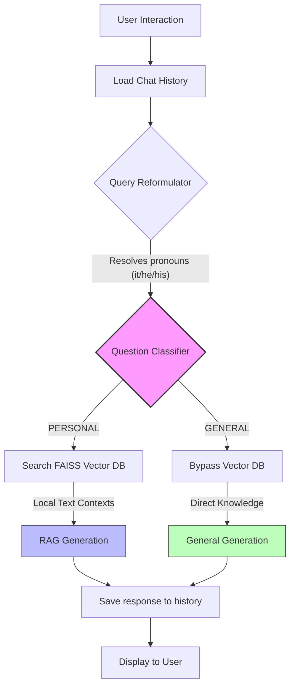

# MeGPT - Architecture Overview

MeGPT is a **Personalized Digital Assistant (Digital Clone)** built to answer questions about Dharmik Pansuriya's professional and personal profile. It leverages Retrieval-Augmented Generation (RAG), Conversational state memory, and Dynamic Query Routing to provide accurate, concise, and contextual responses.

---

## 🛠️ Tech Stack

- **Frontend**: Streamlit (Reactive Chat UI)
- **CLI Workspace**: Standard loops supporting standalone execution
- **LLM**: Groq (`llama-3.1-8b-instant`) for blazing-fast inference
- **Orchestration**: LangChain & LangChain-Community 
- **Embeddings**: HuggingFace (`all-MiniLM-L6-v2`)
- **Vector Database**: FAISS (Local CPU indexing)

---

## ⚙️ Core Architecture Workflow

The system follows a fully automated intelligent routing pipeline for every user prompt:



---

## 🧠 Key Features & Enhancements

### 1. Conversational memory
Powered by `ChatMessageHistory`, the assistant caches the last **5 conversation turns** to allow seamless follow-up questions.

### 2. Standalone Query Reformulation
Before performing lookups, an LLM rewrites contextual prompts into independent structures.
* *Example*: *"What is his HireNova project about?"* followed by *"Which problem does it solve?"* will automatically re-solve internally to *"Which problem does the HireNova project solve?"* for accurate retrieval.

### 3. Smart Question Routing (Local vs General Guard)
To prevent stalling on general inquiries, an active Classifier splits questions:
- **PERSONAL** (`is_personal`): Bound strictly to local text profiles using direct FAISS indexes. Fails safely and gracefully with "I don't know" if the local file does not support claims.
- **GENERAL** (`is_general`): Passes questions regarding general knowledge, coding tips, or geography safely to the standard LLM backbone weights.

---

## 📂 File Structure

```bash
MeGPT/
│
├── data/               # raw profile definitions (.txt)
├── faiss_index/        # compiled binaries loaded at runtime
├── frontend/           # Streamlit application scripts 
├── src/                
│   ├── agents.py       # Core LLM pipelines (Memory, Router, Generator)
│   ├── main.py         # CLI logic
│   └── vector_store.py # Embedding generation utilities
└── .env                # environment overrides
```
